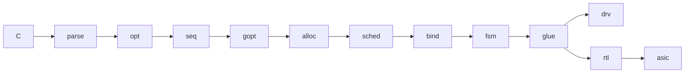
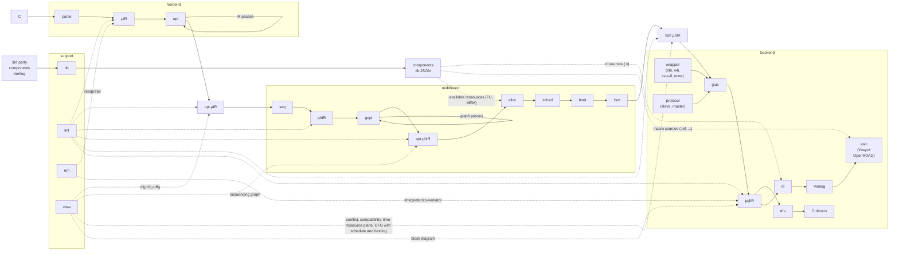

# µhLS - the micro high-level synthesis tool

[](LICENSE)
[](https://github.com/JoGei/uhls/actions/workflows/ci.yml)

## tldr

> µhLS is a compact, hackable HLS toolchain that lowers C through explicit IRs to software drivers, RTL, and ASIC flows.
> µhLS stays intentionally small, explicit, and easy to modify for simplicity.
> µhLS uses a typed, block-based Three-Address-Code IR, µIR, with explicit control-flow edges and no implicit fallthrough and scalar SSA form for easy middle-end analyses and optimizations. Memory accesses are explicit through load/store operations. For software code generation, µIR is extended with direct calls; a later backend-lowering stage may introduce pseudo-operations such as `param` to model calling conventions.

## µhLS flow diagram



<details>
<summary>Detailed µhLS flow diagram</summary>



</details>

## prerequisites

µhLS currently runs directly from this repository through the local `./uhls` launcher.

Required:

- `python3`
- `python3 -m pip install -r requirements.txt`

Helpful for common workflows:

- `dot` from Graphviz for `uhls view --dot` and the `make views` targets
- `verilator` for `uhls run --backend=verilator`
- `yosys` plus an OpenROAD Flow setup for the ASIC-oriented `make asic` flow

## usage

The fastest way to explore the tool is to run the repository-local CLI:

```bash
./uhls --help
```

A minimal frontend flow from C to RTL (via C->µIR->µhIR->µglIR->.v):

**frontend**

```bash
./uhls parse examples/dot4_relu/dot4_relu.c -o dot4_relu.uir
./uhls opt dot4_relu.uir -p inline,prune,dce,cse,copy_prop,const_prop,dce -o dot4_relu.opt.uir
./uhls run dot4_relu.opt.uir
```

**middlend**

```bash
./uhls seq dot4_relu.opt.uir --top dot4_relu -o dot4_relu.uhir
./uhls gopt dot4_relu.uhir -p infer_loops,translate_loop_dialect,infer_static,simplify_static_control,predicate,fold_predicates -o dot4_relu.opt.uhir
./uhls alloc dot4_relu.opt.uhir -exg src/uhls/backend/hls/impl/generic/gen.uhlslib.json --mem=autoram+1024 --vendor=src/uhls/backend/hls/impl/vendor/ihp130/ihp130.uhlslib.json -o dot4_relu.alloc.uhir
./uhls sched --algo asap dot4_relu.alloc.uhir -o dot4_relu.sched.uhir
./uhls bind dot4_relu.sched.uhir --algo left_edge --flatten -o dot4_relu.bind.uhir
./uhls fsm dot4_relu.bind.uhir --encoding=binary -o dot4_relu.fsm.uhir
```

**backend**

```bash
./uhls glue --wrap=slave --protocol=obi dot4_relu.fsm.uhir -o dot4_relu.obi_slave.uglir
./uhls rtl dot4_relu.obi_slave.uglir --hdl=verilog -o dot4_relu.obi_slave.v
./uhls drv dot4_relu.obi_slave.uglir --lang=c -o dot4_relu.obi_slave.h
# to ASIC handoff:
mkdir -p build/asic
./uhls asic dot4_relu.obi_slave.uglir --target=ihp130 --outdir build/asic
# for yosys openroad see examples/Makefile
```

To run the frontend->middleend->backend pipeline above on the example `dot4_relu` through the example Makefile and emit generated artifacts under `./build/` in the directory you invoked `make` from:

```bash
make -C examples [STEM=dot4_relu]
```

To additionally render the standard graphs and wrapped backend artifact (e.g., SoC interconnect WB/OBI):

```bash
make -C examples [STEM=dot4_relu] views wrapped
```

To try full ASIC synthesis with [OpenROAD](https://github.com/the-openroad-project/openroad-flow-scripts) and [Yosys](https://github.com/yosyshq/yosys) using [IHP's 130nm BiCMOS open PDK](https://github.com/IHP-GmbH/IHP-Open-PDK):

> **Note**
> Please install [OpenROAD](https://github.com/the-openroad-project/openroad-flow-scripts) according to their user guide.

```bash
export ORFS_ROOT=/path/to/OpenROAD-flow-scripts/
export YOSYS_EXE=$ORFS_ROOT/dependencies/bin/yosys
make -C examples [STEM=dot4_relu] asic
```

To inspect artifacts directly from the CLI:

```bash
./uhls view dot4_relu.opt.uir --what cdfg --dot -o dot4_relu.cdfg.dot
dot -Tsvg dot4_relu.cdfg.dot > dot4_relu.cdfg.svg
```

To run artifacts directly from the CLI with the interpreter:

```bash
./uhls run build/dot4_relu.uir
./uhls run dot4_relu.opt.uir --backend=verilator --uglir dot4_relu.obi_slave.uglir
```

## quick start with Docker:

> Alternatively to installing OpenROAD manually, you can use this docker image (used by CI) which provides uhLS dependencies: [tumeda/eda-osic-tools](https://github.com/tum-ei-eda/eda-osic-tools/)

```bash
cd path/to/local/uhls/repo
docker pull tumeda/eda-osic-tools:latest-default-ubuntu-latest
docker run --rm -it --network host \
  -v "$(pwd)":/uhls-work \
  -w /uhls-work \
  tumeda/eda-osic-tools:latest-default-ubuntu-latest \
  bash
. /eda-osic-tools/env.sh
pip install -r requirements.txt
# done - run a full asic flow (takes a while... grab your/pref/beverage ☕️):
make -C examples STEM=dot4_relu asic
```

> **Warning**
> This project started as a baseline project to teach university-level courses on HLS algorithms and hardware compilers and heavily relied on LLM-based coding agents to "glue" together the different tools, abstraction levels, and building the µhLS framework. As such many design decisions, such as "*why python only?*" might seem off, but µhLS *tries* to keep it simple.
