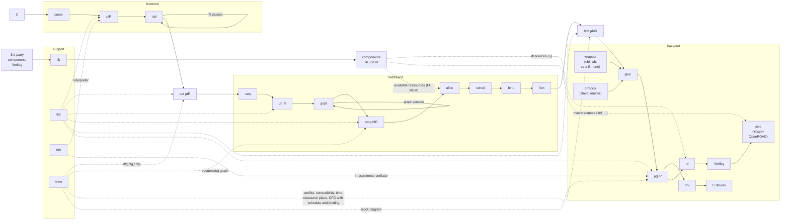

This diagram reflects the current end-to-end artifact flow of the `uhls` toolchain.

```mermaid
flowchart LR
    UC["C"]
    EXT_V["3rd party\ncomponents\nVerilog"]

    subgraph FRONTEND[frontend]
        direction LR
        PARSE["parse"]
        UIR["µIR"]
        OPT["opt"]
        PARSE --> UIR
        UIR --> OPT
        OPT -->|IR passes| OPT
    end

    UIR_OPT["opt µIR"]

    subgraph MIDDLEEND[middleend]
        direction RL
        FSM["fsm"]
        BIND["bind"]
        SCHED["sched"]
        ALLOC["alloc"]
        GOPT["gopt"]
        UHIR_GOPT["opt µhIR"]
        SEQ["seq"]
        UHIR_SEQ["µhIR"]
        SEQ --> UHIR_SEQ
        UHIR_SEQ --> GOPT
        GOPT --> UHIR_GOPT
        GOPT -->|graph passes| GOPT
        UHIR_GOPT --> ALLOC
        ALLOC --> SCHED
        SCHED --> BIND
        BIND --> FSM
    end

    UHIR_FSM["fsm µhIR"]

    subgraph BACKEND[backend]
        direction LR
        WRAPCFG["wrapper\n(obi, wb,\ncv-x-if, none)"]
        PROTCFG["protocol\n(slave, master)"]
        GLUE["glue"]
        UGLIR["µglIR"]
        DRV["drv"]
        CDRV["C drivers"]
        RTL["rtl"]
        VERILOG["Verilog"]
        ASIC["asic\n(Yosys+\nOpenROAD)"]
        GLUE --> UGLIR
        UGLIR --> DRV
        DRV --> CDRV
        UGLIR --> RTL
        RTL --> VERILOG
        VERILOG --> ASIC
        WRAPCFG --> GLUE
        PROTCFG --> GLUE
    end

    subgraph SUPPORT[support]
        direction TB
        LIB["lib"]
        LINT["lint"]
        RUN["run"]
        VIEW["view"]
    end

    COMPLIB["components\nlib JSON"]

    UC --> PARSE
    OPT --> UIR_OPT
    UIR_OPT --> SEQ
    FSM --> UHIR_FSM
    UHIR_FSM --> GLUE

    LINT -.-> UIR
    LINT -.-> UIR_OPT
    LINT -.-> UHIR_SEQ
    LINT -.-> UHIR_GOPT
    LINT -.-> UHIR_FSM
    LINT -.-> UGLIR
    EXT_V --> LIB
    LIB --> COMPLIB
    COMPLIB -.->|"available ressources (FU, MEM)"| ALLOC
    COMPLIB -.->|"rtl sources (.v)"| RTL
    COMPLIB -.->|"macro sources (.lef, ...)"| ASIC
    RUN -.->|interpreter| UIR
    RUN -.->|interpreter/co-verilator| UGLIR
    VIEW -.->|dfg,cfg,cdfg| UIR_OPT
    VIEW -.->|sequencing graph| UHIR_GOPT
    VIEW -.->|conflict, compatibiltiy, time-ressource plane, DFG with schedule and binding| UHIR_FSM
    VIEW -.->|block diagram| UGLIR
```