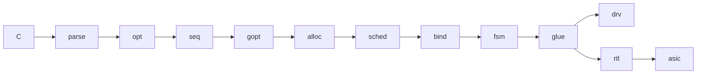

Minimal overview of the main `uhls` flow.

```mermaid
flowchart LR
    C["C"]
    PARSE["parse"]
    OPT["opt"]
    SEQ["seq"]
    GOPT["gopt"]
    ALLOC["alloc"]
    ALLOC --> SCHED
    SCHED["sched"]
    SCHED --> BIND
    BIND["bind"]
    BIND --> FSM
    FSM["fsm"]
    FSM --> GLUE
    GLUE["glue"]
    GLUE --> DRV
    GLUE --> RTL
    DRV["drv"]
    RTL["rtl"]
    RTL --> ASIC
    ASIC["asic"]

    C --> PARSE
    PARSE --> OPT
    OPT --> SEQ
    SEQ --> GOPT
    GOPT --> ALLOC
```